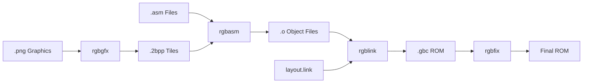

## Introduction

The Pokémon Red and Blue disassembly is a complete reverse-engineering of the original Game Boy games, reconstructed into human-readable assembly language. This project allows developers to understand, modify, and learn from the original game's implementation.

## Project Structure

The disassembly is organized into several key components:

<CardGroup cols={2}>
  <Card title="Source Code" icon="code">
    Assembly files organized by functionality (engine, data, graphics)
  </Card>
  <Card title="Build System" icon="hammer">
    Makefile-based build process using RGBDS toolchain
  </Card>
  <Card title="ROM Banks" icon="layer-group">
    Code and data distributed across 45 ROM banks (16KB each)
  </Card>
  <Card title="Memory Layout" icon="memory">
    Structured RAM, VRAM, and SRAM for game state
  </Card>
</CardGroup>

## Directory Organization

The project follows a clear organizational structure:

```
source/
├── constants/          # Game constants and definitions
│   ├── hardware.inc   # Game Boy hardware registers
│   └── ram_constants.asm
├── engine/            # Game logic and systems
│   ├── battle/       # Battle system
│   ├── overworld/    # Map and movement
│   ├── menus/        # UI systems
│   └── pokemon/      # Pokémon data management
├── data/             # Game data
│   ├── pokemon/      # Species data
│   ├── moves/        # Move definitions
│   └── maps/         # Map data
├── gfx/              # Graphics assets
│   ├── pics/         # Pokémon sprites
│   └── tilesets/     # Map tilesets
├── home/             # Bank 0 (always loaded)
├── ram.asm           # RAM layout definitions
├── main.asm          # ROM sections and includes
└── layout.link       # Linker script
```

## Code Organization

### Section-Based Structure

The code is organized using RGBDS `SECTION` directives that define where code and data are placed in the ROM:

```asm
SECTION "bank1", ROMX

INCLUDE "data/sprites/facings.asm"
INCLUDE "engine/events/black_out.asm"
INCLUDE "data/pokemon/mew.asm"
INCLUDE "engine/battle/safari_zone.asm"
```

### Bank System

The Game Boy's banking system allows access to more memory than the addressable 64KB space:

- **Bank 0 (ROM0)**: Always accessible at `$0000-$3FFF`, contains core routines
- **Banks 1-44 (ROMX)**: Switchable at `$4000-$7FFF`, contain game content
- Banking is managed through the MBC3 memory bank controller

## Build Process

<Steps>
  <Step title="Assembly">
    RGBDS assembler (`rgbasm`) processes `.asm` files into object files
    
    ```bash
    rgbasm -D _RED -Q8 -P includes.asm -o main_red.o main.asm
    ```
  </Step>
  
  <Step title="Linking">
    RGBDS linker (`rgblink`) combines object files using the layout script
    
    ```bash
    rgblink -l layout.link -m pokered.map -n pokered.sym -o pokered.gbc
    ```
  </Step>
  
  <Step title="Fixing">
    RGBDS fix (`rgbfix`) sets ROM header and checksums
    
    ```bash
    rgbfix -jsv -p 0x00 -t "POKEMON RED" pokered.gbc
    ```
  </Step>
  
  <Step title="Graphics Processing">
    RGBGFX converts PNG images to Game Boy tile format
    
    ```bash
    rgbgfx --colors dmg -o gfx/file.2bpp gfx/file.png
    ```
  </Step>
</Steps>

## Key Build Targets

From the Makefile:

```makefile
roms := \
	pokered.gbc \
	pokeblue.gbc \
	pokeblue_debug.gbc

rom_obj := \
	audio.o \
	home.o \
	main.o \
	maps.o \
	ram.o \
	text.o \
	gfx/pics.o \
	gfx/sprites.o \
	gfx/tilesets.o
```

<Note>
The build system supports both Pokémon Red and Blue versions by using conditional assembly directives (`-D _RED` or `-D _BLUE`).
</Note>

## Assembly to ROM Flow



## Memory Map Overview

| Region | Address Range | Description |
|--------|---------------|-------------|
| ROM Bank 0 | `$0000-$3FFF` | Fixed home bank |
| Switchable ROM | `$4000-$7FFF` | Banks 1-44 |
| VRAM | `$8000-$9FFF` | Video memory |
| External RAM | `$A000-$BFFF` | Cartridge save data |
| Work RAM | `$C000-$DFFF` | Main game state |
| Echo RAM | `$E000-$FDFF` | Mirror of WRAM |
| OAM | `$FE00-$FE9F` | Sprite attributes |
| I/O Registers | `$FF00-$FF7F` | Hardware control |
| High RAM | `$FF80-$FFFE` | Fast access RAM |

## Toolchain Requirements

The project uses the RGBDS (Rednex Game Boy Development System) toolchain:

<CardGroup cols={2}>
  <Card title="rgbasm" icon="microchip">
    Assembler that processes Z80-like assembly into object files
  </Card>
  <Card title="rgblink" icon="link">
    Linker that combines objects and places sections in the ROM
  </Card>
  <Card title="rgbfix" icon="wrench">
    ROM fixer that sets header values and checksums
  </Card>
  <Card title="rgbgfx" icon="image">
    Graphics converter for PNG to Game Boy tile format
  </Card>
</CardGroup>

## Version-Specific Features

The build system handles differences between versions:

```asm
IF DEF(_RED)
    ; Red version specific code
    db RED_VERSION_BYTE
ELSE
    ; Blue version specific code
    db BLUE_VERSION_BYTE
ENDC
```

<Info>
The disassembly maintains byte-perfect accuracy with the original ROMs, verified through SHA-1 checksums.
</Info>

## Next Steps

<CardGroup cols={2}>
  <Card title="Game Boy Hardware" href="/architecture/game-boy-hardware" icon="gamepad">
    Learn about the Game Boy's CPU, memory, and hardware
  </Card>
  <Card title="Memory Layout" href="/architecture/memory-layout" icon="memory">
    Explore how RAM and variables are organized
  </Card>
  <Card title="ROM Structure" href="/architecture/rom-structure" icon="file">
    Understand how the ROM is organized
  </Card>
  <Card title="Bank System" href="/architecture/bank-system" icon="layer-group">
    Deep dive into ROM banking mechanics
  </Card>
</CardGroup>
