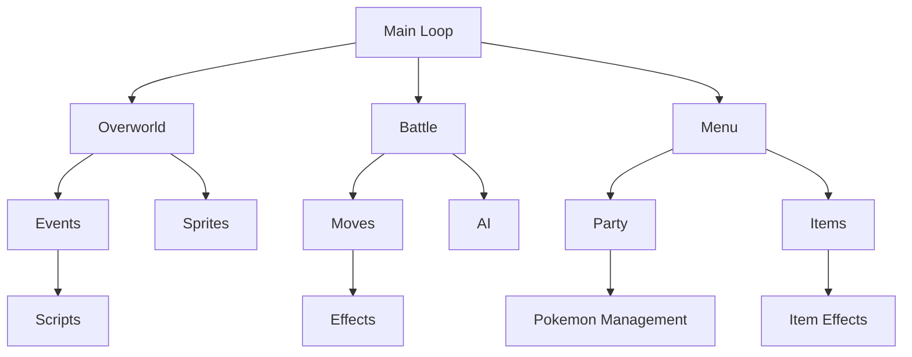

## Overview

The Pokémon Red/Blue engine is organized into specialized modules located in the `engine/` directory. Each module handles a specific aspect of the game, from battles to overworld movement to menu systems.

This modular architecture makes the codebase easier to understand and modify, with clear separation of concerns between different game systems.

## Engine Architecture

```
engine/
├── battle/         - Battle system and combat mechanics
├── overworld/      - Map navigation and field interactions
├── menus/          - Menu systems and UI
├── pokemon/        - Pokémon management and data
├── items/          - Inventory and item effects
├── events/         - Scripting and event handling
├── gfx/            - Graphics and visual effects
├── link/           - Link cable communication
├── math/           - Mathematical utilities
├── debug/          - Debug features
├── slots/          - Game Corner slot machines
└── movie/          - Intro sequences
```

<CardGroup cols={2}>
  <Card title="Battle System" icon="sword" href="#battle-system">
    Combat mechanics, moves, and AI
  </Card>
  <Card title="Overworld" icon="map" href="#overworld-system">
    Map navigation and field movement
  </Card>
  <Card title="Menu Systems" icon="bars" href="#menu-systems">
    UI and player interactions
  </Card>
  <Card title="Pokémon Management" icon="star" href="#pokemon-management">
    Party and PC storage
  </Card>
  <Card title="Item System" icon="box" href="#item-system">
    Inventory and item effects
  </Card>
  <Card title="Event System" icon="bolt" href="#event-system">
    Scripts and triggers
  </Card>
</CardGroup>

## Battle System

**Location:** `engine/battle/`

The battle engine handles all combat mechanics including damage calculation, status effects, AI behavior, and battle animations.

### Core Files

<Accordion title="core.asm - Battle Core Loop">

**Key Functions:**

```asm
BattleCore:
    ; Main battle initialization and loop
    ; Handles turn flow and battle state

SlidePlayerAndEnemySilhouettesOnScreen:
    ; Battle intro animation
    call LoadPlayerBackPic
    call DisplayTextBoxID
    call LoadFontTilePatterns
```

**Battle Flow:**

1. Initialize battle variables
2. Display battle intro
3. Main turn loop:
   - Player chooses action
   - AI chooses action
   - Determine move order
   - Execute moves
   - Apply residual effects
   - Check for battle end
4. Handle battle outcome

</Accordion>

<Accordion title="effects.asm - Move Effects">

**Key Responsibilities:**

- Damage calculation
- Status effect application
- Stat modification
- Special move effects (Substitute, Transform, etc.)

**Example Effect:**

```asm
BurnEffect:
    ; Apply burn status
    ld a, 1 << BRN
    ld [hl], a  ; Set status byte
    call PlayBurnAnimation
    ; Burn does damage each turn
```

</Accordion>

<Accordion title="experience.asm - EXP & Leveling">

**Key Functions:**

```asm
GainExperience:
    ; Calculate experience gain
    ; Apply EXP share if held
    ; Check for level up
    ; Learn new moves

CalcExpGain:
    ; Formula: (base_exp * level) / 7
    ; Modified by trainer battle (1.5x)
    ; Modified by trade status (1.5x)
```

</Accordion>

### Move Effects System

**Location:** `engine/battle/move_effects/`

Each complex move effect has its own file:

- **substitute_effect.asm** - Creates substitute doll
- **confusion_side_effect.asm** - Confusion mechanics
- **haze_effect.asm** - Removes all stat changes
- **recoil_effect.asm** - Recoil damage calculation
- **mist_effect.asm** - Prevents stat reduction

### Battle State Variables

```asm
; Key battle variables in WRAM
wBattleType::          db  ; NORMAL, OLD_MAN, SAFARI
wIsInBattle::          db  ; $FF during battle
wBattleResult::        db  ; WIN, LOSE, DRAW, RAN

; Player battle state
wPlayerBattleStatus1:: db  ; Status flags
wPlayerBattleStatus2:: db  ; More status flags
wPlayerBattleStatus3:: db  ; Even more status
wPlayerMovePower::     db  ; Current move power
wPlayerMoveEffect::    db  ; Current move effect

; Enemy battle state (parallel structure)
wEnemyBattleStatus1::  db
wEnemyBattleStatus2::  db
```

## Overworld System

**Location:** `engine/overworld/`

Manages map navigation, sprite movement, collision detection, and field interactions.

### Core Components

<Accordion title="map_sprites.asm - Sprite Management">

**InitMapSprites:**

```asm
InitMapSprites::
    call InitOutsideMapSprites
    ret c  ; Return if outside map
    ; For indoor maps, load sprite tiles individually
    ld hl, wSpritePlayerStateData1PictureID

LoadMapSpriteTilePatterns:
    ; Load sprite graphics to VRAM
    ; Handle 4-tile sprites vs 2-tile sprites
```

**Sprite System:**

- Up to 16 sprites per map
- Each sprite has two data structures:
  - `SpriteStateData1` - Animation and position
  - `SpriteStateData2` - Map coordinates and movement

</Accordion>

<Accordion title="movement.asm - Movement Engine">

**Key Functions:**

```asm
UpdateSprites::
    ; Update all sprite positions
    ; Handle walking animations
    ; Check for collisions
    ; Process NPC movement patterns

CheckCollision::
    ; Check map collision data
    ; Check sprite-to-sprite collision
    ; Handle warp tiles
    ; Handle ledges
```

**Movement Patterns:**

- STAY - Stand still
- WANDER - Random movement
- WALK - Predefined path
- LOOK - Turn to face player
- SPINRANDOM - Spin randomly
- SPINCLOCKWISE - Rotate clockwise

</Accordion>

<Accordion title="player_state.asm - Player Control">

**HandlePlayerInput:**

```asm
CheckForPlayerMovement::
    ; Read joypad input
    ; Check if player can move
    ; Initiate walking animation
    ; Handle running (held B button)
    ; Update facing direction

DoPlayerMovement::
    ; Move player sprite
    ; Scroll map if needed
    ; Check for wild encounters
    ; Check for trainer battles
```

</Accordion>

<Accordion title="hidden_events.asm - Item Balls & Signs">

**Hidden Item System:**

```asm
CheckForHiddenObject::
    ; Check if player facing hidden item
    ; Check if already obtained
    ; Display message
    ; Add item to bag
    ; Set obtained flag

CheckForSign::
    ; Check if player facing sign
    ; Display sign text
```

</Accordion>

### Field Moves

**Location:** `engine/overworld/` (various files)

- **cut.asm** - Cut down trees
- **surf.asm** - Water navigation  
- **strength.asm** - Push boulders (`push_boulder.asm`)
- **flash.asm** - Illuminate dark caves

## Menu Systems

**Location:** `engine/menus/`

Handles all menu interfaces including the start menu, party menu, bag, and PC systems.

### Key Menus

<Accordion title="start_sub_menus.asm - Start Menu">

**Start Menu Options:**

```asm
StartMenuItems:
    db "POKéDEX@"
    db "POKéMON@"
    db "ITEM@"
    db "PLAYER@"
    db "SAVE@"
    db "OPTION@"
    db "EXIT@"

DisplayStartMenu::
    ; Draw menu window
    ; Handle cursor movement
    ; Process selection
    ; Call submenu handlers
```

</Accordion>

<Accordion title="party_menu.asm - Pokémon Menu">

**Party Menu Features:**

- View Pokémon summary
- Switch Pokémon order
- Use items on Pokémon
- Teach TMs/HMs
- Select for battle

**Key Functions:**

```asm
DisplayPartyMenu::
    ; Draw party status boxes
    ; Show HP bars
    ; Display status conditions
    ; Handle selection

PartyMenuSwap::
    ; Swap two party Pokémon
    ; Update internal data
    ; Redraw menu
```

</Accordion>

<Accordion title="pokedex.asm - Pokédex Interface">

**Pokédex Modes:**

```asm
PokedexMode_List::
    ; Alphabetical listing
    ; Shows caught/seen status
    ; Search functionality

PokedexMode_Entry::
    ; Display Pokémon entry
    ; Show sprite and description
    ; Display height/weight
    ; Show area caught
```

</Accordion>

<Accordion title="pc.asm - PC System">

**PC Types:**

- Someone's PC - Pokémon storage
- Bill's PC - Box management
- Player's PC - Item storage
- Prof. Oak's PC - Pokédex rating
- League PC - Hall of Fame

**Key Files:**

- `players_pc.asm` - Item storage
- `oaks_pc.asm` - Pokédex rating
- `league_pc.asm` - Hall of Fame records

</Accordion>

## Pokémon Management

**Location:** `engine/pokemon/`

Handles Pokémon data loading, storage, evolution, and status management.

### Core Systems

<Accordion title="load_mon_data.asm - Data Loading">

**LoadMonData:**

```asm
LoadMonData::
    ; Input: wcf91 = species ID
    ; Load base stats
    ; Load types
    ; Load learnset
    ; Calculate stats from DVs

CalcStats::
    ; Formula: ((Base + DV) * 2 + EV^0.5) * Level / 100 + Level + 10
    ; For HP: add 10 instead of Level + 10
```

</Accordion>

<Accordion title="add_mon.asm - Adding Pokémon">

**AddPartyMon:**

```asm
AddPartyMon::
    ; Check if party is full
    ; Initialize Pokémon data
    ; Generate DVs
    ; Set initial moves
    ; Calculate stats
    ; Set current HP to max

GivePokemon::
    ; Used for gift Pokémon
    ; Displays nickname screen
    ; Adds to party or PC
```

</Accordion>

<Accordion title="evos_moves.asm - Evolution & Moves">

**Evolution Types:**

```asm
EVOLVE_LEVEL  ; Level up evolution
EVOLVE_ITEM   ; Stone evolution
EVOLVE_TRADE  ; Trade evolution

TryEvolvingMon::
    ; Check evolution conditions
    ; Play evolution animation
    ; Transform to new species
    ; Learn evolution moves
```

</Accordion>

<Accordion title="bills_pc.asm - Box Storage">

**Box System:**

```asm
; 12 boxes with 20 Pokémon each
DEF MONS_PER_BOX EQU 20
DEF NUM_BOXES    EQU 12

WithdrawPokemon::
    ; Move from box to party
    ; Verify party has space

DepositPokemon::
    ; Move from party to box
    ; Verify box has space

ReleasePokemon::
    ; Permanently delete Pokémon
```

</Accordion>

## Item System

**Location:** `engine/items/`

Manages inventory, item effects, and TM/HM mechanics.

### Key Components

<Accordion title="inventory.asm - Bag Management">

**Inventory Functions:**

```asm
AddItemToInventory::
    ; wcf91 = item ID
    ; wItemQuantity = amount
    ; Check if item exists in bag
    ; Stack with existing or add new slot
    ; Sort key items separately

RemoveItemFromInventory::
    ; Decrease quantity
    ; Remove slot if quantity = 0
    ; Compress item list
```

</Accordion>

<Accordion title="item_effects.asm - Item Usage">

**Effect Types:**

- Medicine (Potions, Full Heal, etc.)
- Status healing (Antidote, Awakening, etc.)
- Battle items (X Attack, Dire Hit, etc.)
- Evolution stones
- Poké Balls
- Key items

**Effect Handler:**

```asm
ItemUsePtrTable:
    dw ItemUsePotion
    dw ItemUseAntidote
    dw ItemUsePokeBall
    ; ... etc

UseItem::
    ; Get item effect pointer
    ; Call effect function
    ; Update menu if needed
```

</Accordion>

<Accordion title="tmhm.asm - TM/HM System">

**Teaching Moves:**

```asm
TeachTMMove::
    ; Check if Pokémon can learn
    ; Select move slot (delete if needed)
    ; Learn new move
    ; Don't consume HM (only TMs consumed)

CheckCanLearnTMHM::
    ; Check compatibility bitfield
    ; 7 bytes = 56 bits for 55 TM/HMs
```

</Accordion>

## Event System

**Location:** `engine/events/`

Handles scripting, hidden items, gifts, trades, and special events.

### Event Types

<Accordion title="Hidden Events">

**Location:** `engine/events/hidden_events/`

**Hidden Items:**

```asm
HiddenItemPositions::
    ; Each map has hidden item data
    db map_id
    db y, x          ; Position
    db item_id       ; What item
    db flag_id       ; Obtained flag
```

**Hidden Objects:**

- Item balls
- Hidden items (Itemfinder)
- PC terminals
- Vending machines
- Signs and posters

</Accordion>

<Accordion title="in_game_trades.asm - NPC Trades">

**Trade System:**

```asm
TradeData:
    db TRADE_FOR, TRADE_GIVE  ; Pokémon species
    dw nickname               ; Traded Pokémon's nickname
    dw OTID                   ; Original Trainer ID
    db DVs                    ; Individual values

DoInGameTrade::
    ; Check player has requested Pokémon
    ; Show trade animation
    ; Swap Pokémon
    ; Set trade flag
```

</Accordion>

<Accordion title="give_pokemon.asm - Gift Pokémon">

**Receiving Pokémon:**

```asm
GivePokemon::
    ; Starter Pokémon (Oak's lab)
    ; Gift Pokémon (Eevee, Lapras, etc.)
    ; Fossil resurrection
    ; Game Corner prizes
```

</Accordion>

## Graphics System

**Location:** `engine/gfx/`

Handles graphics loading, animation, and visual effects.

### Key Systems

- **screen_effects.asm** - Screen transitions
- **sprite_oam.asm** - Sprite rendering
- **load_pokedex_tiles.asm** - Pokédex graphics
- **mon_icons.asm** - Menu icons

## Module Interactions



## Best Practices

<CardGroup cols={2}>
  <Card title="Understand Module Boundaries" icon="layer-group">
    Each module has clear responsibilities. Keep related functionality together.
  </Card>
  <Card title="Use Existing Functions" icon="recycle">
    Many common operations have dedicated functions. Don't reinvent the wheel.
  </Card>
  <Card title="Follow Data Flow" icon="arrows-alt">
    Understand how data moves between modules through RAM variables.
  </Card>
  <Card title="Test Module Changes" icon="vial">
    Changes to core modules can have wide-reaching effects. Test thoroughly.
  </Card>
</CardGroup>

## Key RAM Variables

### Global Variables

```asm
; Temp storage used across modules
wcf91::  db  ; Universal temp (often holds species/item ID)
wd11e::  db  ; Another common temp
hld::    db  ; HRAM temp

; System state
wJoyIgnore::          db
wUpdateSpritesEnabled:: db
wAutoTextBoxDrawingControl:: db
```

### Module-Specific Variables

Each module typically has a dedicated WRAM section for its variables. For example:

- Battle: `wBattle*` variables
- Menu: `wMenu*` variables  
- Sprite: `wSprite*` variables

## Related Pages

- [Constants Reference](/reference/constants) - Constants used by modules
- [Macros Reference](/reference/macros) - Helper macros
- [Data Structures](/reference/data-structures) - Memory layouts
